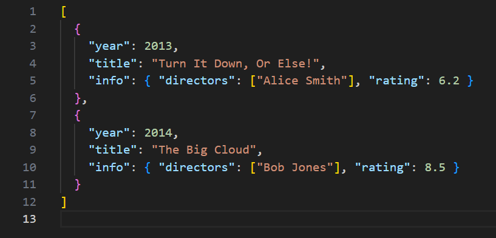
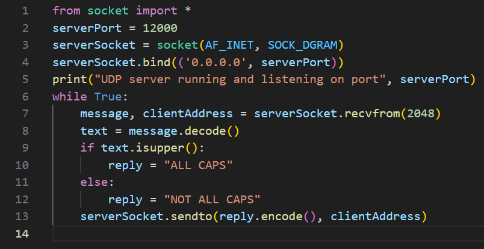
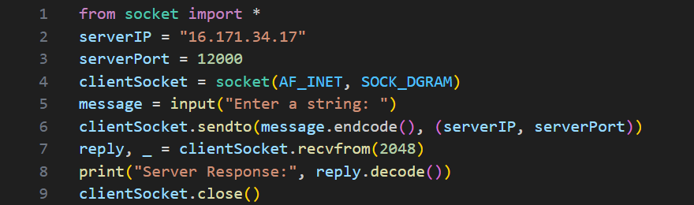
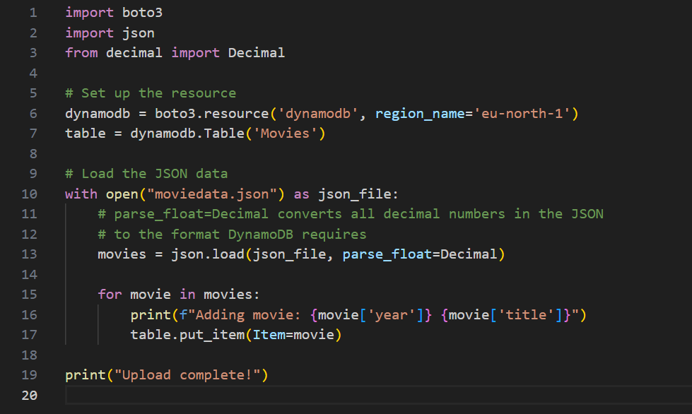

# Lab 4 Logbook: AWS Connectivity, Client-Server, NoSQL Database

**ELEC50009 Information Processing — Lab 4**

---
  - Lab completed in full. All sections (EC2 setup, file transfer, client–server communication, DynamoDB setup and operations, optional exercises) completed successfully.
  - This logbook documents the actual lab setup and procedures as per the lab manual.

---

## Lab Objectives

This lab introduced the workflow for:

- Creating an EC2 instance on Amazon Web Services (AWS)
- Communicating with a server on AWS using a client–server setup (UDP)
- Working with Amazon’s NoSQL database service, DynamoDB

I used an AWS Free Tier (or AWS Academy) account.

---

## Section 1: Creating an EC2 Instance

### 1.1 EC2 Definition and Purpose

**EC2 (Elastic Compute Cloud)** provides resizable virtual servers in the cloud for running applications. I used an EC2 instance as a remote computer that could be connected to from my local machine.

**Public IP address:** AWS assigned a public IPv4 address to the instance. I used this address to connect to the instance via TCP, UDP, and SSH.

### 1.2 Configuration Settings 

Below are the configurations that I used for this lab:

| Setting           | Value / Requirement                                      |
|------------------|----------------------------------------------------------|
| Instance type    | `t3.micro` or `t2.micro`                                 |
| Operating system | Ubuntu Linux                                             |
| Key pair         | Created and downloaded a `.pem` file for secure SSH login |
| Network          | Public IPv4 address enabled                              |
| Security group   | Configured to **allow all inbound traffic** (for simplicity in this lab) |
| Storage          | Default settings                                         |

**Post-creation:** I ensured the instance was running and noted its **public IP address** for SSH login from my local computer. This would allow me to connect to and communicate with the EC2's virtual server. Think of it as a key to find the correct machine on AWS servers to transmit information. 

---

## Section 2: Logging into the EC2 Instance

- **Windows:** WSL (Windows Subsystem for Linux)


1. **Located the key file:** I downloaded the `.pem` key file during the creation of the EC2. I moved it to the working directory. 

<p align="center">  </p>

2. **Set permissions on the key file:** I ran `chmod 400` on the private key so SSH would accept it. This is because SSH is designed to be highly secure, and it will refuse to use a private key file if the file is "too open". The chmod 400 command sets the file permissions so that only the owner can read the file.

   ```ubuntu
   chmod 400 MyLabKey.pem
   ```

3. **Connected via SSH:**
   ```ubuntu
   ssh -i MyLabKey.pem ubuntu@16.171.34.17
   ```

4. **First connection only:** When I first connected, I was prompted about the host key. I had to accept the connection.

5. **Verified connection:** Once logged in, I ran:
   ```ubuntu
   hostname
   ```
   to confirm the instance was responding.

6. **Exited** when done with `exit` to return to the local terminal.

---

## Section 3: Transferring Files

I used **scp** (secure copy) to transfer files between my local machine and the EC2 instance. I first practised with a dummy text file; I then used the same method for Python scripts and `moviedata.json`.

<p align="center">  </p>

### 3.1 Copying a File to EC2

1. **Created a test file locally:**
   ```ubuntu
   echo "Hello from my local machine" > test.txt
   ```

2. **Copied it to EC2** (from the local terminal):
   ```ubuntu
   scp -i MyLabKey.pem test.txt ubuntu@16.171.34.17:~
   ```
   This placed `test.txt` in the home directory (`~`) of the `ubuntu` user on the instance.

3. **Verified on EC2:** I SSH’d into the instance and ran:
   ```ubuntu
   cat test.txt
   ```
   I confirmed the contents and then exited with `exit`.

### 3.2 Copying a File from EC2 to Local

4. **Copied the file back with a new name:**
   ```ubuntu
   scp -i MyLabKey.pem ubuntu@16.171.34.17:~/test.txt test_2.txt
   ```

5. **Verified locally** with `cat test_2.txt`.

**Key takeaway:** I used the same `scp` pattern later to transfer `udp_server.py`, `moviedata.json`, and other lab files to the EC2 instance.

---

## Section 4: Client–Server Communication

I set up the software environment for client–server communication: Python on the EC2 instance, then a simple UDP server (on EC2) and UDP client (on my local machine).

### 4.1 Installing Python on the EC2 Instance

Ubuntu on the instance did not have the desired Python tools by default. I updated my installer, and installed python3 and python3-pip. I also verified that they were the most recent versions.  

### 4.2 A Simple UDP Client and Server in Python

**Server behaviour:** The server listened on port **12000**. It received a string from the client, checked if it was entirely in uppercase, and replied with either `"ALL CAPS"` or `"NOT ALL CAPS"`.

**UDP Server (`udp_server.py`)** — I ran this on EC2:

- `serverPort = 12000`
- `socket(AF_INET, SOCK_DGRAM)`
- `serverSocket.bind(('0.0.0.0', serverPort))` — bound to all interfaces so the server could accept packets from my local machine as well as from the network.
- In a loop: `recvfrom(2048)`, decode message, check `text.isupper()`, set reply to `"ALL CAPS"` or `"NOT ALL CAPS"`, then `sendto(reply.encode(), clientAddress)`.


<p align="center">  </p>

**UDP Client (`udp_client.py`)** — I ran this locally:

- `serverIP` = public IP of the EC2 instance (*16.171.34.17*); `serverPort = 12000`
- `socket(AF_INET, SOCK_DGRAM)`
- Prompt for a string, send with `sendto()`, receive with `recvfrom(2048)`, print the server response, then `clientSocket.close()`

I set the client’s `serverIP` to the actual EC2 public IP. The server was bound to `0.0.0.0` so it listened on all interfaces and accepted incoming UDP from my machine.

<p align="center">  </p>

### 4.3 Running the Client–Server Example

1. **Created the files locally:** I created `udp_server.py` and `udp_client.py` on my local machine (with the EC2 public IP set in the client).

2. **Transferred the server to EC2:**
   ```ubuntu
   scp -i MyLabKey.pem udp_server.py ubuntu@16.171.34.17:~
   ```

3. **Ran the server on EC2:** I SSH’d into the instance and ran `python3 udp_server.py`, leaving that terminal running.

4. **Ran the client locally:** I opened a second local terminal and ran `python3 udp_client.py`, then entered both uppercase and lowercase strings and observed the server’s response.

### 4.4 Troubleshooting: Connection and Reachability

**Issue:** UDP “Connection refused” or timeout when running the client.

**Causes and fixes:**

| Cause | Fix |
|-------|-----|
| Wrong address (private IP or localhost) | Set client to EC2 **public IP** (from AWS console) so traffic from the internet can reach the instance. |
| Security group blocking UDP | In EC2 → Security Groups → Inbound rules: add UDP port **12000** from 0.0.0.0/0 (or “Anywhere”). |
| Server not listening | Run `udp_server.py` on EC2, bound to `0.0.0.0:12000`, before starting the client. |

After correcting the IP and opening the firewall, the client completed the handshake successfully (RTT later measured at ~28.10 ms).

### 4.5 Comparison: Localhost vs. Cloud Latency

| Environment   | Target              | Typical latency observed | Notes                          |
|---------------|---------------------|--------------------------|--------------------------------|
| Localhost     | 127.0.0.1:12000     | &lt; 1 ms                 | Same machine                   |
| Cloud (EC2)   | Public IP:12000     | 10–50+ ms                 | Depends on region and distance |

---

## Section 5: Setting Up a Database

I configured the EC2 instance to access **Amazon DynamoDB** (managed NoSQL database) so that programs on the instance could create tables, load data, and perform queries without storing long-term credentials on the machine.

### 5.1 Configuring EC2 to Access DynamoDB

**Approach:** I attached an **IAM role** to the EC2 instance so that software on the instance could access DynamoDB using temporary credentials. No Access Key ID or Secret Access Key were stored on the instance.

**IAM role:** An IAM role is an AWS identity that grants permissions to an AWS service (here, EC2) to access other AWS resources without using long-term credentials.

**Created an IAM role:** In the AWS console I opened IAM, created a new role, chose **AWS service** under “Trusted entity” and **EC2** under “Use case”, then created the role. I also attached the **AmazonDynamoDBFullAccess** policy, named the role (e.g. `Lab4-EC2-DynamoDB-Role`), and attached it to my EC2 instance via **EC2 → Instances → Actions → Security → Modify IAM role**, so the instance could call DynamoDB with no credential files or environment variables on the machine.


### 5.2 Installing boto3

**boto3** is the AWS SDK for Python, used to interact with DynamoDB from Python scripts. I installed it on the EC2 instance via the system package manager:

I logged into the EC2 instanse, and installed python3-boto3, and the instance was ready to run DynamoDB scripts. 


### 5.3 DynamoDB: Basic Use Examples

I used the lab’s Python scripts (adapted from the AWS DynamoDB Developer Guide) for table creation, loading sample data, and basic querying. I also used the additional scripts for create/read/update/delete and for query/scan operations.

### 5.3.1 Creating a DynamoDB Table

**Objective:** Create the **Movies** table on DynamoDB from the EC2 instance.

I ran **MoviesCreateTable.py** on the EC2 instance.

**Table structure created:**

- **Composite primary key:**
  - **Partition key (HASH):** `year` (Number)
  - **Sort key (RANGE):** `title` (String)

The script used `boto3.resource('dynamodb', region_name='us-east-1')` to obtain a resource object. **Provisioned throughput** defined the maximum read and write capacity for the table (e.g. 10 read and 10 write capacity units).

**Verification:** I ran the following in the Python interpreter on EC2:

```ubuntu
python3
>>> import boto3
>>> db = boto3.resource('dynamodb', region_name='us-east-1')
>>> print(list(db.tables.all()))
>>> exit()
```

The output included the **Movies** table.

### 5.3.2 Loading Data into an Existing Table

**Objective:** Populate the Movies table with data from a JSON file.

I ran **MoviesLoadData.py** on the EC2 instance. The **data source** was `moviedata.json`.

<p align="center">  </p>

**JSON format (per lab manual):** Each item had:

- `year` (partition key)
- `title` (sort key)
- `info` (nested object): e.g. `directors`, `release_date`, `rating`, `genres`, `image_url`, `plot`, `rank`, `running_time_secs`, `actors`

The script read the JSON file and used `put_item` to insert each movie into the Movies table.

### 5.3.3 Creating and Reading Individual Items

- **MoviesItemOps01.py:** Adds a new item to the table (primary key + attributes). I ran this script.
- **MoviesItemOps02.py:** Reads an item from the table (e.g. by primary key). I ran this script.

<p align="center">  </p>

I used the code and output of these scripts to understand how to create and read individual items.

### 5.3.4 Scripts for Further Operations

I ran the additional scripts for more advanced operations:

- **MoviesItemOps03.py**, **MoviesItemOps04.py**, **MoviesItemOps05.py** — update, delete, conditional delete, query with projection, etc.
- **MoviesQuery01.py**, **MoviesQuery02.py** — query by partition key (and optional sort key condition).
- **MoviesScan.py** — scan the table with an optional filter.

I ran and tested these scripts against the data loaded into the Movies table.

### 5.4 NoSQL Schema: Partition Key vs. Sort Key

| Key type       | Attribute | Type   | Role in Movies table                    |
|----------------|-----------|--------|-----------------------------------------|
| Partition key  | `year`    | Number | Groups items by year; partition layout  |
| Sort key       | `title`   | String | Uniqueness within a year; sort order   |

Queries that specified `year` (and optionally a range on `title`) were efficient; they used the partition and sort key. Queries that filtered only on non-key attributes typically required a scan.

### 5.5 Troubleshooting Log: Data Load

#### Issue 1: FileNotFoundError for moviedata.json

**Symptom:** When I ran `MoviesLoadData.py` on the EC2 instance it failed because `moviedata.json` was not found.

**Cause:** The file existed only on my local machine (e.g. WSL) and had not been transferred to the EC2 instance.

**What I did:** I transferred the file using `scp` (same pattern as Section 3):

```ubuntu
scp -i MyLabKey.pem moviedata.json ubuntu@16.171.34.17:~
```

I then ran the load script from the EC2 home directory (where I had copied `moviedata.json`).

#### Issue 2: Float types not supported (TypeError)

**Symptom:** During the bulk load, DynamoDB returned an error such as **“Float types are not supported. Use Decimal instead.”**

**Cause:** JSON numbers are parsed as Python `float` by default. DynamoDB does not accept native Python `float` for numeric attributes; it requires `Decimal` (or integers).

**What I did:**

1. I imported the decimal module: `from decimal import Decimal`
2. When loading the JSON file I used `parse_float=Decimal` in `json.load()`:

```python
with open("moviedata.json") as json_file:
    movie_list = json.load(json_file, parse_float=Decimal)
```

After this change, the bulk load completed successfully.

**Key takeaway:** DynamoDB numeric attributes must be supplied as Python `Decimal` (or integers), not raw `float`.

---

## Section 6: Exercises (Optional)

### 6.1 Exercise 1: RTT Performance

**Objective:** Measure the average **Round-Trip Time (RTT)** between the local machine (UDP client) and the EC2 instance (UDP server).

**Method:**

- Send a single integer (or small message) from the client to the server.
- Define RTT as the time for that message to travel to the server and for the response to return to the client.
- Repeat this process **500 times**.
- Compute and print the **running average** of the RTT.

**Configuration used:** EC2 region **eu-north-1** (Stockholm, Sweden); UDP on port 12000.

**Result:** Average RTT was **28.10 ms** for the 500-packet test.

**Interpretation:** RTT reflects propagation delay, queuing, and processing. A value of ~28 ms from the client location to eu-north-1 is consistent with geographic distance and typical internet routing. This baseline is useful for comparing regions or estimating latency in client–server designs.

### 6.2 Exercise 2: CRUD & Filter Logic

**Objective:** Write Python scripts to perform specific query operations on the fully populated Movies table.

- **Task A:** Print **complete information** for the movie **“After Hours”** released in the year **1985**.
- **Task B:** Print **all movies** released **before the year 2000**.

**Implementation notes:**

- **Task A (After Hours, 1985):** Use **get_item** with the full primary key (`year=1985`, `title="After Hours"`). This is key-based retrieval: one read, one item, independent of table size — effectively **O(1)** for that item.
- **Task B (pre-2000):** Use a **scan** with a filter expression (e.g. `year < 2000`), or multiple **query** calls per partition key if using only key conditions. Scan reads items (in pages) and applies the filter; the number of results equals the number of matching items in the dataset. Scan cost scales with table size — **O(n)** over scanned items.

**Why different result counts?** Task A targets a single key, so the result is always one item. Task B returns every item that matches the filter (all pre-2000 movies), so the count depends on the dataset.

### 6.3 Data Analysis: get_item vs. scan Efficiency

| Metric       | get_item (key-based)   | scan (filtered)             |
|-------------|-------------------------|-----------------------------|
| Complexity  | O(1) per item           | O(n) over scanned items     |
| Read units  | One (or less) per item  | Every scanned item consumed|
| Best for    | Known primary key       | Ad-hoc filters on table     |
| Scaling     | Constant per request    | Grows with table size       |

**Key takeaway:** For known primary keys, use **get_item** or **query**. Use **scan** only when the filter cannot be expressed on the key (e.g. non-key attributes or complex conditions), and be aware that cost scales with the number of items scanned.

---

## Summary Table: Lab 4 Components

| Section | Component                  | Outcome / Command or tool                          |
|---------|----------------------------|----------------------------------------------------|
| 1       | EC2 instance               | t3.micro/t2.micro, Ubuntu, .pem key, public IP, allow all inbound |
| 2       | SSH login                  | `chmod 400` key; `ssh -i your-key.pem ubuntu@IP1`  |
| 3       | File transfer              | `scp -i your-key.pem file ubuntu@IP1:~` (and reverse) |
| 4       | Python on EC2              | `sudo apt update`, `sudo apt install -y python3 python3-pip` |
| 4       | UDP server                 | Port 12000, bind `0.0.0.0`, “ALL CAPS” / “NOT ALL CAPS” |
| 4       | UDP client                 | EC2 public IP, port 12000, `sendto` / `recvfrom`   |
| 5       | EC2 → DynamoDB             | IAM role + AmazonDynamoDBFullAccess, Modify IAM role on instance |
| 5       | boto3 on EC2               | `sudo apt-get -y install python3-boto3`; verify with `import boto3` |
| 5       | Movies table               | Partition key `year`, sort key `title`; MoviesCreateTable.py |
| 5       | Load data                  | MoviesLoadData.py, moviedata.json, `parse_float=Decimal` |
| 5       | Item ops                   | MoviesItemOps01/02 (create/read); 03–05, Query01/02, Scan |
| 6       | Exercise 1 (RTT)           | 500 packets, running average RTT ≈ 28.10 ms (eu-north-1) |
| 6       | Exercise 2                 | Task A: get_item “After Hours” 1985; Task B: scan year &lt; 2000 |

---

## Key Takeaways by Section

- **Sections 1–2:** EC2 instance type (t3.micro/t2.micro), Ubuntu, .pem key, public IP, and “allow all inbound” for the lab. Use `chmod 400` on the key and `ssh -i MyLabKey.pem   ubuntu@16.171.34.17` to log in.
- **Section 3:** Use `scp` to transfer files (e.g. `udp_server.py`, `moviedata.json`) to and from the EC2 instance; same pattern as the test file.
- **Section 4:** Install Python on EC2 with `apt`; UDP server on port 12000 bound to `0.0.0.0`; client uses EC2 public IP. Connection issues are often due to wrong IP or server not running (and, if using a custom security group, blocked inbound traffic).
- **Section 5:** Attach an IAM role with AmazonDynamoDBFullAccess to the EC2 instance; install boto3 with `sudo apt-get -y install python3-boto3`. Movies table has composite key (year, title). Transfer `moviedata.json` with `scp`; use `parse_float=Decimal` in `json.load()` to avoid float/Decimal errors during load.
- **Section 6:** RTT exercise: 500 packets, average ~28.10 ms to eu-north-1. Exercise 2: Task A uses get_item (O(1)); Task B uses scan (O(n)). Prefer get_item/query when the key is known; use scan only when necessary.
