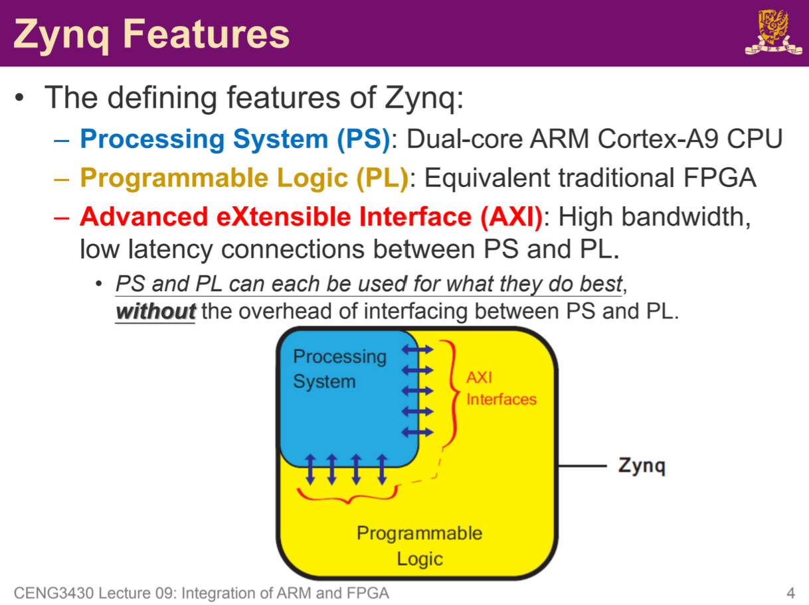
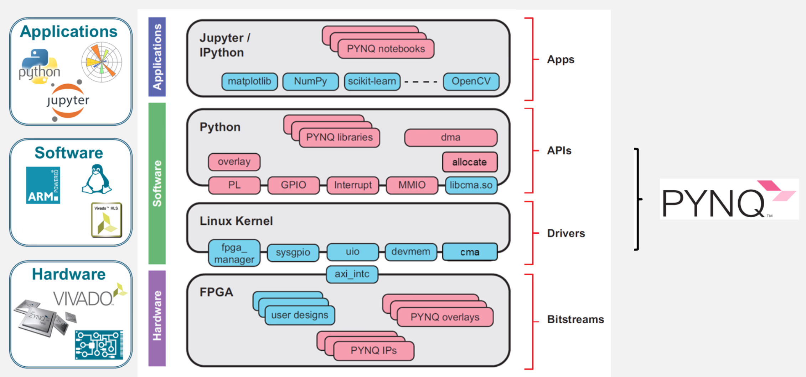
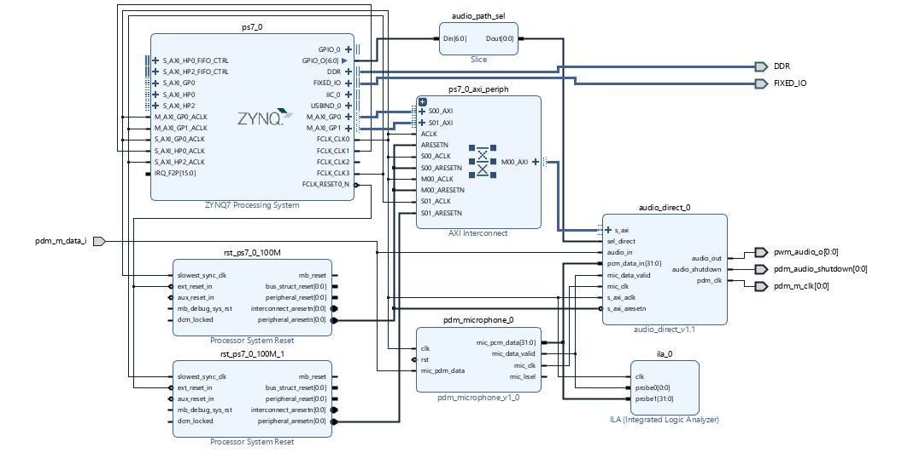

# PYNQ Z1 Architecture:
The PYNQ-Z1 board is built around the Xilinx Zynq-7000 SoC (System on Chip). Unlike traditional processors or standalone FPGAs, the Zynq architecture tightly integrates Processing System (PS) and Programmable Logic (PL) onto a single chip.

## Processing System
It is a ARM processor running Ubuntu Linux, Jupyter Notebook server and the Python environment. It provides flexibility for general purpose computing.

## Programmable Logic
The FPGA fabric, used for hardware acceleration, low latency signal processing, and real time control. It provides performance and parallelism.

## PYNQ Stack

### PYNQ Overlay
At the bottom is the Overlay. This is the hardware design (`.bit` file generated by Vivado) that configures the FPGA fabric (PL). In Lab 2, the Base Overlay was modified to include a PDM-to-PCM converter for the microphone.

### Interface (AXI)
Advanced eXtensible Interface (AXI) is the physical communication connecting the PS and PL. It allows the ARM processor to read from and write to specific memory addresses that map to hardware registers in the FPGA.

### C++ Drivers
AXI provides the path, the C++ Drivers provide the logic to use that path. These drivers operate in the PS, they act as a bridge between Python and low-level hardware registers.

They use MMIO (Memory Mapped I/O). The C++ driver sends data to a specific memory address, and the AXI bus routes that data to the corresponding hardware component in PL (e.g. Audio FIFO).

### Python Drivers (APIs)
Purpose of python drivers is to wrap the C++ drivers into user-friendly classes to be called in Jupyter Notebook. The Python uses CFFI (C Foreign Function Interface) to load compiled C++ shared libraries (e.g. libaudio.so). This allows you to call a function such as `audio.record()` in Python, which triggers C++ register operations.

### Jupyter Notebook
The top layer is the user interface. Running on the PS, it allows you to visualise data, control the board, and execute the Python APIs.

## Lab 2 Design:

### ZYNQ7 Processing System
Function: This block represents the ARM cores. It initiates the whole system, runs the Python code, and handles the recorded audio files (.wav).

Connections: 
* `M_AXI_GP0`: This is the Master AXI General Purpose port. It is output of commands leaving the CPU to control the hardware peripherals
* `S_AXI_GP0_ACLK`:
* `S_AXI_HP0_ACLK`:
* `FCLK_CLK0`, `FCLK_CLK1`, `FCLK_CLK2`, `FCLK_CLK3`: PL FPGA fabric doesn't have its own clock, must be passed from PS to make sure all IP blocks are running in sync
* `FCLK_RESET0_N`: Output from PS to PL, reset signal that's connected to Processor System Reset to make sure all PL and PS are synchronised in reset

### AXI Interconnect
Function: The Zynq PS has only a few AXI ports, but our design has multiple hardware modules (Microphone, Audio Direct, etc.) that need control. The AXI Interconnect acts as a switch, splitting the single connection from the PS into multiple connections for different IP blocks

Addressing: It ensures that when the CPU writes to address X, it goes to the Microphone, and address Y goes to the audio controller

Connections:
* `ACLK`: Drives the internal logic of the AXI interconnector - same clock frequency as ZYNQ7
* `S00_ACLK`: Syncs clock with input side with the master (ZYNQ7 PS)
* `M00_ACLK`: Syncs clock with output side with the slave peripheral (audio_direct)
* `S00_AXI`, `S01_AXI`: Slave interfaces, allows the master (PS ARM processor) to communicate to multiple slaves (IP - audio_direct). Doesn't seem like `S01_AXI` connection is used ??
* `M00_AXI`: Master inferface, output commands from PS to PL through this port.

### Processor System Resets
2 PS reset blocks: `rst_ps7_0_100M` and `rst_ps7_0_100M_1`

Reasoning: FPGAs often run on multiple clocks
* System Clock (50MHz): Runs the AXI interface and general control logic.
* Audio Clock: Audio often requires specific frequencies (2.4 MHz) to get desired sample rates

Each clock domain requires its own dedicated reset synchronisation to prevent stability issues when the system restarts

## Hardware-Software interaction example
Python (Jupyter Notebook): Execute `audio.record()`

Python Driver (`audio.py`): The Python prepares the buffer and calls the underlying C function via CFFI.

C++ Driver (`libaudio.so`): The C function `record()` runs. It writes specific values (e.g., 0x1) to the Audio Direct IP's control register address.

AXI Bus: The command travels from the PS, through the AXI Interconnect, to the PL.

Hardware (PL):
* The `pdm_microphone` IP captures real-world sound, converts PDM to PCM.
* The `audio_direct` IP receives the PCM data and fills its hardware FIFO.

Data Transfer: The C++ driver reads the data from the hardware FIFO and stores it in a RAM buffer.

File Save: Python takes that RAM buffer and saves it as a .wav file on the Linux filesystem.