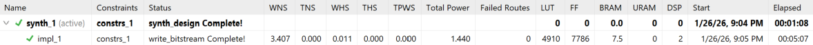
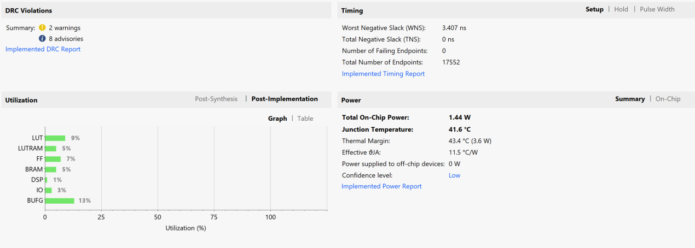
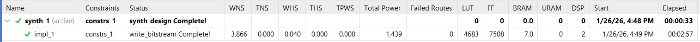
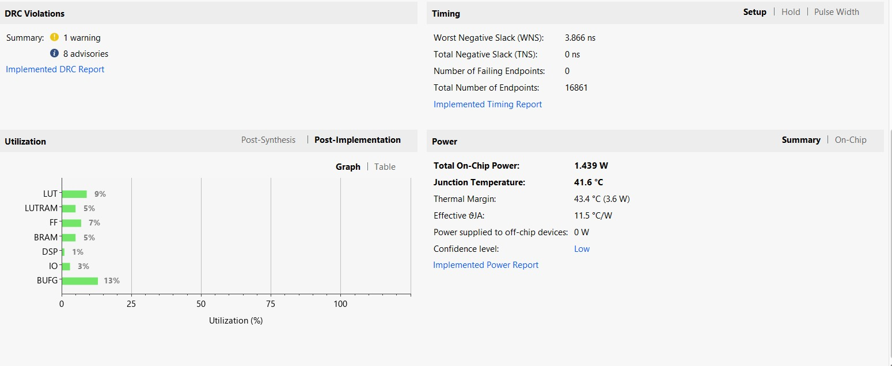

# Lab 2 Logbook: Audio Processing

---
  - Note that I haven't done parts 2.2 (Software) and 2.3 tasks 2E, 2F (I have left these for you guys to do / further test later)
  - This is a rough draft, feel free to make additions / changes

---

## 2.3 Audio Processing (Hardware)

In this section, we looked at the audio components on the PYNQ-Z1 base overlay, understanding how 
drivers interact with hardware components and using this to create hardware blocks for PDM-to-PCM conversion.

### Audio module in the base overlay

In this module, a PDM-to-PWM bypass is used taking a 1-bit signal from the microphone in the PYNQ 
board, and sends this signal to the PWM output for the speakers. This process is extremely fast given that 
both signals are only 1-bit wide, however, these signals are difficult to manipulate mathematically in terms
of processing and cleaning the audio. PCM audio is multi-bit (in the case of these labs 32-bits) which allow
for multiple adaptations to the audio signal including:
- Filtering out white noise
- Adjusting the volume of the signal

Given the speed of the signal transfer, the AXI peripheral, i.e. `d_axi_pdm_v1_2_S_AXI`, provides a FIFO buffer
which holds onto output bits from the hardware when the CPU is unable to process these bits fast enough and is
busy.

### Task 2B: Creating an Audio Frontend (PDM-to-PCM Converter)

In this task, we used a simplified version of tbe BaseOverlay using the `lab2-skeleton.tcl` skeleton
file. In this overlay, we are required to update blocks `pdm_microphone_0` and `audio_direct_0` in the final
schematic shown below:

<p align="center">  </p>

In this section we use a CIC compiler. A CIC compiler acts a digital filter to handle signals with multiple bits
which also allows for changing the sampling frequency of data. In this case, we use the filter for decimation
(takes a high speed PDM stream and converts it to a lower-speed PCM stream). This is used for efficiency, given that
the CIC filters only use adders and delay lines (and other filters often require multipliers), and anti-aliasing, 
ensuring a smoothed out signal preventing noise produced when lowering sample rate.

We connect the CIC compiler to the `pdm_mic.v` file given to us (ensuring decimation of the 1-bit PDM input). The
following adjustments are made to the CIC compiler in Vivado as such:
- **No. stages = 5-** This is larger than usual (often 3-4) allowing for sharper audio
- **Initial Sample Frequency = 2.4Mhz-** Microphone frequency of the PYNQ-Z1 board (from PDM signal frequency)
- **Clock Frequency = 50MHz-** Clock input of the PYNQ-Z1 board

### Task 2C: Modyfing the audio_direct IP to work with PCM Data

This task is an addition on Task 2B but focused on `audio_direct`. A new top module named `audio_direct_v1_1.v` (the
one from the `hw_files` as well as a `audio_direct_v1_1_S00_AXI.v` were used replacing the original files in the
BaseOverlay. The `audio_direct_v1_1.v` file has the following changes:

---

**Changes to I/O Ports:**

```
input wire [31:0] pcm_data_in, // Ensures 32-bit PCM number sample is sent all at once by CIC compiler
input wire mic_data_valid, // Controls when CIC compiler can send 32-bit PCM sample to FIFO
```
---

**Removal of `audio_direct_path`**

This module is removed as it originally allowed for PDM-to-PWM bypass. Given we need decimation for the PCM output 
signal through the CIC filter, this module becomes redundant, hence the following code is removed:

```
wire pdm_clk_o1, pdm_clk_o2;
wire audio_out_o1, audio_out_o2;
wire pwm_sdaudio_o1, pwm_sdaudio_o2;
wire pwm_audio_i, pwm_audio_o;

...

    audio_direct_path audio_direct_path_inst(
        .clk_i(s_axi_aclk),
        .en_i(sel_direct),
        .pdm_audio_i(audio_in),
        .pdm_m_clk_o(pdm_clk_o1),
        .pwm_audio_o(audio_out_o1),
        .done_o(),  // no connection required
        .pwm_audio_shutdown(pwm_sdaudio_o1)
);

    assign pdm_clk = sel_direct ? pdm_clk_o1:pdm_clk_o2;
    assign audio_shutdown = sel_direct ? pwm_sdaudio_o1:pwm_sdaudio_o2;
    assign audio_out = sel_direct ? audio_out_o1:audio_out_o2;  // audio_shutdown is negative logic
```

Also note the following:
- The original code uses a MUX with `sel_direct` to chose between two different paths of PDM signals
- Given the removal of signals `audio_out_o1` and `audio_out_o2`, the output ports `audio_shutdown` and `audio_out`
  must be altered
- Originally, the use of to clocks allow for different clock signals in conversion, the new build will use a single
  path for PDM signals thus only requiring a single clock. This is done with the `pdm_clk_gen.v` file in the `hw_files`
  which handles the frequency required for the microphone from the 50MHz system clock.

The `pdm_clk_gen` module will tick once every 40 ticks of the system clock allowing for ~2.4MHz frequency for the
microphone (i.e. it does 100M/40). Also note that this is part of the overall block `pdm_microphone_0`.

---

**PCM Logic to AXI interface additions**

The following mappings were added as such:

```
audio_direct_v1_1_S_AXI_inst ( // name of the new AXI module, given in the hw_files
.pdm_m_data_i     (pcm_data_in), // connects 32-bit PCM signal to AXI module's input
.mic_data_valid_i (mic_data_valid), // tells AXI module's FIFO when a new 32-bit sample is ready to be stored
.pwm_audio_o      (audio_out),
.pwm_sdaudio_o    (audio_shutdown),
.pdm_m_clk_o      (pdm_clk), // clock signal generated in pdm_clk_gen.v
```

Also note that in the `audio_direct_v1_1_S00_AXI.v` module, the module describing the FIFO has its port changed to 
`.srst` due to  synchronous reset port being used and named in the FIFO in `pdm_microphoone_0`.

Also note that the FIFO in `pdm_microphone_0` is used collect all PDM bits for the CIC compiler whereas the FIFO in
the AXI module is used store 32-bit PCM samples for the CPU to process.

Also note that the files `pdm_ser` and `pdm_rxtx` have been removed for the following reasons:

1. These files handle the 1-bit PDM-to-PWM stream, this is not useful for PDM-to-PCM conversiom - making `pdm_rxtx`
   unusable.
2. A CIC compiiler acts as a Deserializer (given it takes 1-bit and outputs 32) - making pdm_ser unnecessary.
3. Won't allow for 32-bit PCM streams to pass to the receiver.


### Evaluating hardware and performance
In this section we evaluated how our appraoch compares to the standard configuration and also explored hardware-software co-optimisation.

The lab instructions guide a modification of the existing `audio_direct` block. However, we identified that simply widening the ports leave significant redundant logic.

|Feature|Standard Lab Approach|Hardware Optimised Approach|Benefit of Optimisation|
|-------|---------------------|---------------------------|-----------------------|
|Bypass Path| Retains `audio_direct_path`|Removed|Eliminates unused MUX logic and routing resources, as we are performing recording/playback via RAM, not immediate hardware loopback|
|Deserialisation|Uses `pdm_rxtx` shift registers|Removed|We utilise the CIC compiler as the deserialiser. Connecting the CIC output directly to the AXI FIFO removes the need for the `pdm_rxtx` state machine wrapper|
|Complexity|High|Lower use of resource|Reducing the module count minimises the risk of timing violations and simplifies the data path|

**Hardware Evaluation:** By removing `pdm_rxtx` and `pdm_ser`, we significantly reduced LUT and FF utilisation. The standard design required state machines to manage the valid/ready handshake for the PDM stream; our design relies on the CIC compiler's native validity signal fed directly into the FIFO, this created a more optimised hardware for performance.

**Standard configuration:**
<p align="center">  </p>
<p align="center">  </p>

**Hardware optimised design:**
<p align="center">  </p>
<p align="center">  </p>

### Hardware-Software Co-Design Exploration
We discovered that the system's stability depends entirely on matching the Hardware Decimation Rate with the Software Buffer Allocation. We tested two configurations to optimize performance:

1. The "Standard" Configuration (decimation 64)

    * Hardware: 50 MHz Clock / decimation 64 -> ~39 kHz Sample Rate.

    * Software: Python multiplier * 2.

    Outcome: This produced standard audio quality.

2. The "High-Fidelity" Configuration (Our Choice)

    * Hardware: 50 MHz Clock / decimation 32.

    * Software: Python multiplier * 4.

    Outcome: By lowering the hardware decimation to 32, we doubled the data throughput to ~78 kHz. We found that we must increase the Python buffer multiplier to 4 to match this speed.

      * Failures observed: If we kept the multiplier at 2 while running decimation 32, the buffer filled in 2.5 seconds (instead of 5)

      * Matched timing: With the multiplier at 4, we achieved high-fidelity recording with stable timing.